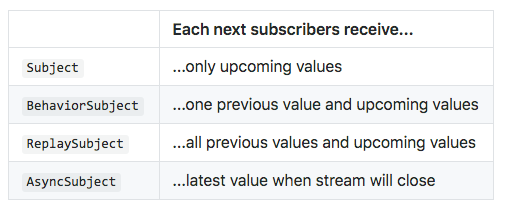
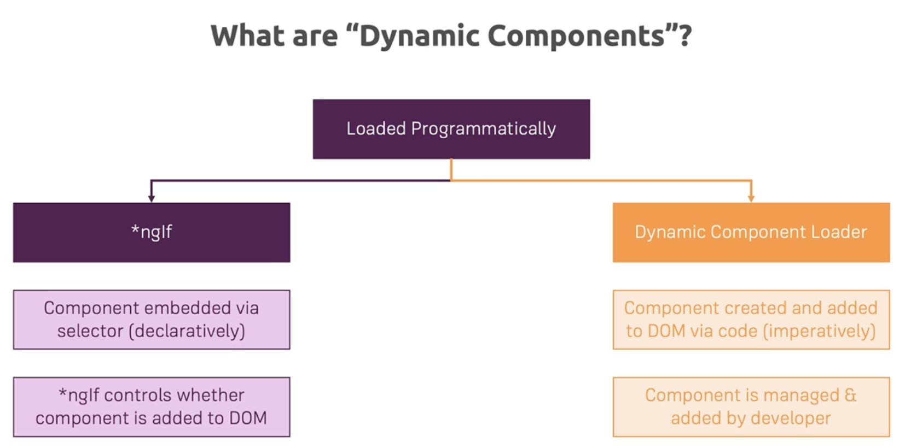
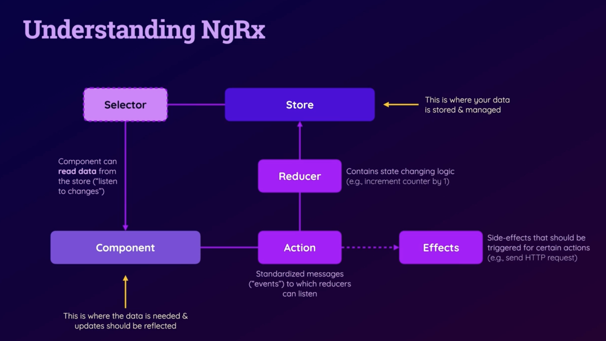

# Angular Course

These notes and the code are taken from the [udemy course](https://www.udemy.com/course/the-complete-guide-to-angular-2) by [Maximilian Schwarzmüller](https://www.udemy.com/user/maximilian-schwarzmuller/).

* [Angular Course](#angular-course)
  * [Angular CLI cheatsheet](#angular-cli-cheatsheet)
  * [Section 1](#section-1)
    * [Styles](#styles)
    * [Resources](#resources)
  * [Section 2](#section-2)
    * [Directives](#directives)
      * [Attribute directives](#attribute-directives)
      * [Structural directives](#structural-directives)
    * [Resources](#resources-1)
  * [Section 3 / 4](#section-3--4)
  * [Section 5](#section-5)
    * [@Input: Passing data to component](#input-passing-data-to-component)
    * [@Output: sharing content with other components](#output-sharing-content-with-other-components)
    * [Style encapsulation](#style-encapsulation)
    * [References to HTML elements](#references-to-html-elements)
    * [Accessing DOM elements from the components](#accessing-dom-elements-from-the-components)
    * [Content projection](#content-projection)
  * [Section 9: Services and Dependency injection](#section-9-services-and-dependency-injection)
    * [Resources](#resources-2)
  * [Section 11: Routing](#section-11-routing)
    * [Accessing route params](#accessing-route-params)
    * [Query params and fragments](#query-params-and-fragments)
    * [Redirection](#redirection)
    * [Guards](#guards)
    * [Resources](#resources-3)
  * [Section 13: Observables](#section-13-observables)
    * [Resources](#resources-4)
  * [Section 15: Forms](#section-15-forms)
    * [Template driven](#template-driven)
    * [Resources](#resources-5)
  * [Section 17: Pipes](#section-17-pipes)
    * [Resources](#resources-6)
  * [Section 18: HTTP](#section-18-http)
  * [Section 21: Dynamic components](#section-21-dynamic-components)
    * [Resources](#resources-7)
  * [Section 24: Standalone components](#section-24-standalone-components)
  * [Section 25: Angular signals](#section-25-angular-signals)
    * [Resources](#resources-8)
  * [Section 26: NgRx](#section-26-ngrx)


## Angular CLI cheatsheet

```bash
npm install -g @angular/cli
ng new [PROJECT NAME] --directory . # add directory if you're already into it
cd [PROJECT NAME]
ng serve

# New components
ng generate component <name> # or ng g c <name>
```

## Section 1

* [NgModel](https://angular.io/api/forms/NgModel): Creates a FormControl instance from a domain model and binds it to a form control element. You need to import FormsModule in order to use it

### Styles

Global styles can be defined in `src/styles.css`, defined in `architect` field in `angular.json`. There you can list other global styles (eg CSS libraries).

### Resources

* [Angular CLI reference](https://angular.io/cli)
* [Notes about the code](https://www.udemy.com/course/the-complete-guide-to-angular-2/learn/lecture/6709112#questions/8079942)

## Section 2

**Databinding** allows the communication between the template and the business logic (TypeScript code).

**Output** from logic to template:

* **String interpolation**: `{{ data }}`
* **Property binding**: `[property]="data"`

**Input** from template to logic:

* **Event binding**: `(event)="expression"`

**Both**:

* **Two-way binding**: `[(ngModel)]="data"`

### Directives

* **attribute directives**: look like a normal HTML attribute and only affect/change the element they are added to
* **structural directives**: look like a normal HTML attribute but have a leading `*`. Affect a whole area in the DOM (elements get added/removed).

#### Attribute directives
This directives must be imported in the main declarations for the app. DOM modifications may be regukated through
the `RendererV2` or using `HostBinding` directive:

```html
<!-- Template -->
<p appHighlight [defaultColor]="'yellow'" [highlightColor]="'red'">Receives a green background</p>
```

```typescript
@Directive({
    selector: '[appHighlight]'
})
export class HighlightDirective implements OnInit {
    constructor(
        private elementRef: ElementRef,
        // private renderer: Renderer2
    ) {}
    @Input() defaultColor: string = 'transparent';
    @Input() highlightColor: string = 'blue';
    
    @HostBinding('style.backgroundColor') backgroundColor: string;
  
    ngOnInit() {
        this.backgroundColor = this.defaultColor;
        // this.renderer.setStyle(this.elementRef.nativrElement, 'background-color', 'blue', false, false)
    }
    
    @HostListener('mouseenter') mouseover(eventData: Event) {
        this.backgroundColor = this.highlightColor
    }

    @HostListener('mouseleave') mouseleave(eventData: Event) {
        this.backgroundColor = this.defaultColor
    }
}
```

A built-in attribute directive is `ngStyle`. It's useful when you want to bind a particular CSS property value to the value of a component's property. For example let's assume we have a method in our component named `getColor` that return `green` when the server is online, otherwise `red`. We can tweak the background color with:

```html
<p [ngStyle]="{backgroundColor: getColor()}">
    Server is {{ getServerStatus() }}
</p>
```

`ngClass` works very similarly, tweaking the application of a class depending on a component status.

#### Structural directives

```html
<!-- Template -->
<div *appUnless="onlyOdff">
  ...
</div>
```

```typescript
// works like *ngIf
@Directive({
  selector: '[appUnless]'
})
export class UnlessDirective implements OnInit {
  @Inoput() set appUnless(condition: boolean) {
    if (!condition) {
        this.vcRef.createEmbeddedView(this.templateRef);
    } else {
        this.vcRef.clear()
    }
  }

  constructor(private templateRef: TemplateRef, private vcRef: ViewContainerRef) {
  }
}
```


### Resources

* [Built-in directives](https://angular.io/guide/built-in-directives)
* [Renderer2](https://angular.io/api/core/Renderer2)

## Section 3 / 4

Create a new project without routing, no strict mode:

```bash
ng new --no-strict --routing false course-project
```

For debugging purposes, you can set a breakpoint into the TypeScript components  by accessing `webpack://` subfolders in teh *Sources* tab in the developer console.

## Section 5

By default, all properties defined in a component are accessible inside a component. You have to explicitly say which properties can be set by the outside components.

### @Input: Passing data to component
So for example, considering a component named `server-element` inside our main `app` component, we can pass a property belonging to `app` to `server-element`:

```html
<div class="container">
  <app-cockpit></app-cockpit>
  <hr>
  <div class="row">
    <div class="col-xs-12">
      <app-server-element
        [element]="serverElement"
        *ngFor="let serverElement of serverElements"
      ></app-server-element>
    </div>
  </div>
</div>
```

Here while we're looping through `serverElements`, we can bind the variable `serverElement` to the prperty `element` inside `server-element`:

```typescript
import { Component, Input } from '@angular/core';

@Component({
  selector: 'app-server-element',
  templateUrl: './server-element.component.html',
  styleUrls: ['./server-element.component.css']
})
export class ServerElementComponent {
  @Input() element: { name: string, type: string, content: string }
}
```

### @Output: sharing content with other components

On the contrary, if we want to pass the data from an inner component to its parent, we can use `EventEmitter` and `@Output` directive:

```html
<!-- parent -->
<div class="container">
  <app-cockpit
    (serverCreated)="onServerAdded($event)"
    (bluePrintCreated)="onBlueprintAdded($event)"
  ></app-cockpit>
  ...
```

and

```typescript
export class CockpitComponent {
  @Output() serverCreated = new EventEmitter<{serverName: string, serverContent: string}>();
  @Output() bluePrintCreated = new EventEmitter<{serverName: string, serverContent: string}>();

  newServerName = '';
  newServerContent = '';

  onAddServer() {
    this.serverCreated.emit({
      serverName: this.newServerName,
      serverContent: this.newServerContent
    })
  }

  onAddBlueprint() {
    this.bluePrintCreated.emit({
      serverName: this.newServerName,
      serverContent: this.newServerContent
    })
  }
}
```

### Style encapsulation

Also notice that Angular enforces style encapsulation, so the styles defined in a component, aren't automatically available to others. For sharing styles, there's always the `angular.json` file in which you can define global styles. This behavior can also be changed by the [encapsulation option](https://angular.io/guide/view-encapsulation) for the component.

### References to HTML elements

Another way of passing information from the template to the TypeScript code, is applying a reference to an HTML element:

```html
<div class="row">
  <div class="col-xs-12">
    ...
    <input
      type="text"
      class="form-control"
      #newServerName
    >
    ...
    <button
      class="btn btn-primary add-server"
      (click)="onAddServer(newServerName)">Add Server</button>
    ...
  </div>
</div>
```

We pass the reference to the method and then we can update our TypeScript code:

```typescript
onAddServer(newServerName: HTMLInputElement) {
  this.serverCreated.emit({
    serverName: newServerName.value,
    serverContent: this.newServerContent
  })
}
```

### Accessing DOM elements from the components

You can also access elements in the template through `ViewChild`: you still put a reference for example to the input element, but this time you get its content through `ViewChild`:

```typescript
@ViewChild('serverContentinput') newServerContent: ElementRef

onAddServer(newServerName: HTMLInputElement) {
  this.serverCreated.emit({
    serverName: newServerName.value,
    serverContent: this.newServerContent.nativeElement.value
  })
}
```

### Content projection

Another nice feature is the possibility to inject into the component's template the data from a different component's template. By default, everything put between angular brackets of a component is silently discarded, unless you use the `ng-content` element:

```html
<!-- cockpit template -->
<app-server-element
  [element]="serverElement"
  *ngFor="let serverElement of serverElements"
>
  <p class="card-text">
    <strong *ngIf="serverElement.type === 'server'" style="color: red">{{ serverElement.content }}</strong>
    <em *ngIf="serverElement.type === 'blueprint'">{{ serverElement.content }}</em>
  </p>
</app-server-element>

<!-- server-element template -->
<div class="card-body">
  <!-- <h5 class="card-title">Special title treatment</h5> -->
  <ng-content></ng-content>
</div>
```

Docs:
* https://angular.io/guide/content-projection
* https://angular.io/guide/lifecycle-hooks

## Section 9: Services and Dependency injection

Typical uses for services are avoid duplication centralizing functions. Another good use case
is getting information for external sources, like an API.  
The injection may operate in these modes:
* you can pass the service in the component's constructor and register it in the
`provider` component's metadata (eg `providers:  [ HeroService ]`). If a parent component has been already provided
with the service, there's no need to do it also in its children.
* you can pass the service in the component's constructor and decorate the service with 
`@Injectable({providedIn: <string>})`. If you don't pass the `providedIn` argument, 
the injectable is not provided in any scope automatically and must be added to a providers array of an @NgModule,
@Component or @Directive. Usually you specify `root`. This also allows Angular to use lazy loading.

In general, you can register the service:
* in `AppModule`: the same service instance is available Application-wide
* in `AppComponent`: same instance of the service is available to all components but not for other services
* Any other component: the same instance is available for the component and all its child components.

### Resources

* [Services](https://angular.io/guide/architecture-services)
* [Dependency Injection in Angular](https://angular.io/guide/dependency-injection-overview)

## Section 11: Routing

The routing module (which can be automatically created by Angular CLI) is the following:

```typescript
import { NgModule } from '@angular/core';
import { Routes, RouterModule } from '@angular/router';

const routes: Routes = [
  {
    path: '/servers',
    component: ListComponent,
    children: [
      { path: ':id', component: SingleComponent }
    ]
  }
];

@NgModule({
  imports: [RouterModule.forRoot(routes)],
  exports: [RouterModule]
})
export class AppRoutingModule { }
```
Add `AppRoutingModule` to your `AppModule`'s imports and then you can use 
`<router-outlet></router-outlet>` in your `app.component.html` template.  
if you want you can still use the Angular CLI:

```bash
ng generate module app-routing --flat --module=app
```
The flat option will prevent the module from being in its folder and the module option will be sure to import the new
module into the AppModule.  
The order of routes is important because the Router uses a first-match wins strategy when 
matching routes, so more specific routes should be placed above less specific routes. 
List routes with a static path first, followed by an empty path route, which matches the 
default route. The wildcard route comes last because it matches every URL and the Router 
selects it only if no other routes match first.  
After that, use [routerLink](https://angular.io/guide/router-reference#router-links) to 
redirect to the correct component and render a "new page".

### Accessing route params

* **Snapshot**: you get the current snapshot of this route at a particular moment in time. 
(Contains the information about a route associated with a component loaded in an outlet at a 
particular moment in time. [ActivatedRouteSnapshot](https://angular.io/api/router/ActivatedRouteSnapshot#description) 
can also be used to traverse the router state
tree.)
* **params**: is A Observable and you can subscribe to it. (An observable of the matrix 
parameters scoped to this route.). [See Docs here](https://angular.io/api/router/ActivatedRoute#description).

Example:

```typescript
 ngOnInit() {
    this.user = { id: this.route.snapshot.params['id'] }
    this.route.params.subscribe((params: Params) => { this.user.id = params['id']; })
 }
```
This subscription is automatically destroyed by Angular so you don't have to manually unsubscribe.

### Query params and fragments

Passing query parameters can be done like the following:
```html
<!-- Assuming you have defined a route like "/servers/:id/edit" -->
<a
 [routerLink]="['/servers', 5, 'edit]"
 [queryParams]="{allowEdit: '1'}"
 fragment="loading"
>
```

Programmatically this could be done in the following way:

```typescript
export class MyComp {
  constructor(private router: Router, private activatedRoute: ActivatedRoute) {
  }
  
  // passing parameters
  onLoadServer(id: number) {
      this.router.navigate(['servers', id, 'edit'], {queryParams: { allowEdit: '1'}, fragment: 'loading'})
  }
  
  // retrieving params
  ngOnInit() {
      // the methods below just retrieve the initial values but incapable of getting their updates
      let queryParams = this.activatedRoute.snapshot.queryParams
      let fragment = this.activatedRoute.snapshot.fragment
    
      // the following can be used to get their updates
      this.activatedRoute.queryParams.subscribe()
      this.activatedRoute.fragment.subscribe()
  }
}
```
you can also pass relative path to `navigate` method and to override the current query params for the activated route or 
to preserve them:

```typescript
this.router.navigate(['servers', id, 'edit'], { relativeTo: this.route, queryParamsHandling: 'preserve|merge' })
```

### Redirection

In case you want to manage 404:

```typescript
const routes: Routes = [
  { path: '/servers', ...},
  { path: 'not-found', component: NotFoundComponent },
  { path: '**', redirectTo: 'not-found' }  // must be last    
];
```
### Guards

This should be executed before the route gets loaded and supports asynchronous operations.

```typescript
import {Injectable} from "@angular/core";

@Injectable()
export class AuthGuard implements CanActivate, CanActivateChild {
  constructor(private authService: AuthService, private router: Router) {
  }

  canActivate(route: ActivatedRouteSnapshot, state: routerstateSnapshot) {
      return this.canActivate(route, state)
  }
  
  canActivate(route: ActivatedRouteSnapshot, state: routerstateSnapshot) {
    return this.authService.isAuthenticated()
            .then((authenticated: boolean) => {
                if (authenticated) {
                    return true;
                }

              this.router.navigate(['/'])
            }) 
  }
}
```

Then you define the guard in the route specifications:

```typescript
const routes: Routes = [
  // { path: '/servers', canActivateChild: [AuthGuard], ...},  to limit the guard to the children
  { path: '/servers', canActivate: [AuthGuard], ...},
  { path: 'not-found', component: NotFoundComponent },
  { path: '**', redirectTo: 'not-found' }  // must be last    
];
```
Also remember to add AuthGuard between the providers in the main AppModule.

### Resources

* [Angular Routing](https://angular.io/guide/routing-overview)

## Section 13: Observables

Observables are lazy Push collections of multiple values. To invoke the Observable and see these values, we need to
subscribe to it. Pull and Push are two different protocols that describe how a data Producer can communicate with a data
Consumer.

|      | PRODUCER                                | CONSUMER                                |
|------|-----------------------------------------|-----------------------------------------|
| Pull | Passive: produces data when requested.  | Active: decides when data is requested. |
| Push | Active: produces data at its own pace.  | Passive: reacts to received data.       |

Every JavaScript Function is a Pull system. The function is a Producer of data, and the code that calls the function is
consuming it by "pulling" out a single return value from its call. Promises are the most common type of Push system in
JavaScript today.  
RxJS introduces Observables, a new Push system for JavaScript. An Observable is a Producer of multiple values, "pushing"
them to Observers (Consumers).  
Then you can handle data, errors and completion. When an error occurs then the observable get cancelled and
never completes.  
The essential concepts in RxJS which solve async event management are:

* **Observable**: represents the idea of an invokable collection of future values or events.
* **Observer**: is a collection of callbacks that knows how to listen to values delivered by the Observable.
* **Subscription**: represents the execution of an Observable, is primarily useful for cancelling the execution.
* **Operators**: are pure functions that enable a functional programming style of dealing with collections with operations like map, filter, concat, reduce, etc.
* **Subject**: is equivalent to an EventEmitter, and the only way of multicasting a value or event to multiple Observers.
* **Schedulers**: are centralized dispatchers to control concurrency, allowing us to coordinate when computation happens on e.g. setTimeout or requestAnimationFrame or others.



### Resources

* [RxJs Playground](https://playcode.io/1701335)

## Section 15: Forms

| Forms           | Details                                                                                                                                                                                                                                                                                                                                                                                                             |
|-----------------|---------------------------------------------------------------------------------------------------------------------------------------------------------------------------------------------------------------------------------------------------------------------------------------------------------------------------------------------------------------------------------------------------------------------|
| Reactive        | Provide direct, explicit access to the underlying form's object model. Compared to template-driven forms, they are more robust: they're more scalable, reusable, and testable. If forms are a key part of your application, or you're already using reactive patterns for building your application, use reactive forms.                                                                                            |
| Template-driven | Rely on directives in the template to create and manipulate the underlying object model. They are useful for adding a simple form to an app, such as an email list signup form. They're straightforward to add to an app, but they don't scale as well as reactive forms. If you have very basic form requirements and logic that can be managed solely in the template, template-driven forms could be a good fit. |

### Template driven

It requires FormsModule to be imported:

```typescript
import { FormsModule } from '@angular/forms';
```
Then you add `ngModel` to the elements of your form that Angular should consider. Those elements
must have also the attribute `name` so that the controls will be registered with that name.  
The form element will get the directive `(ngSubmit)="onSubmit(formRef) #formRef=ngForm"` where we pass a form reference 
to the method.

```typescript
class MyComponent {
  /* alternative approach for accessing the form without passing the reference to submit
  @ViewChild('formRef') myForm = 'ngForm' */
    
  onSubmit(formRef: NgForm) {
    
  }
}
```

You can add [built-in validators](https://angular.io/api/forms/Validators) as attributes to your controls. HTML5 validation
by default is disabled by Angular, you need to add `ngNativeValidate` to re-enable it.  
Some CSS classes are automatically added when some forms event occurs, for example:
* `ng-invalid`: if a field is not valid
* `ng-touched`: when the user has typed something or at least put the focus on a field.

Here is a form field example with validation:

```html
<input type="email" class="form-control" [ngModel]="myDefaultValue" required email #email="ngModel">
<span class="help-block" *ngIf="!email.valid && email.touched">Please enter a valid email</span>
```

`ngModelGroup` can be used to group multiple controls into one object, that can also be used for validation.  
You cn programmatically edit your form either using he form reference with the method `setValue` (totally replace its
values) or the method `patchValue` (specifically change something).

### Resources

* [Forms](https://angular.io/guide/forms-overview)

## Section 17: Pipes

Pipes allow to transform output in your template. They can be built-in or custom. For example, to format a date as you
want, you could use the `date` pipe (`dateObj` is a `Date` object):

```typescript
{{ dateObj | date:"MMM dd, yyyy 'at' hh:mm a" }}

// pipes are chainable
{{ dateObj | date:"MMM dd, yyyy 'at' hh:mm a" | uppercase }}
```

A custom pipe can be defined like this:

```typescript
import { Pipe, PipeTransform } from '@angular/core';
/*
 * Raise the value exponentially
 * Takes an exponent argument that defaults to 1.
 * Usage:
 *   value | exponentialStrength:exponent
 * Example:
 *   {{ 2 | exponentialStrength:10 }}
 *   formats to: 1024
*/
@Pipe({
  standalone: true,
  name: 'exponentialStrength'
})
export class ExponentialStrengthPipe implements PipeTransform {
  transform(value: number, exponent = 1): number {
    return Math.pow(value, exponent);
  }
}
```
This can be imported in a single component with `imports: [ExponentialStrengthPipe]` or put into the declarations of
`AppModule` to be globally available.


### Resources

* [Pipes](https://angular.io/guide/pipes)
* [List of built-in pipes](https://angular.io/api?status=stable&type=pipe)

## Section 18: HTTP

Put `HttpClientModule` in the imports directive of `AppModule`.

```typescript
import { HttpClientModule } from '@angular/common/http';

// You can then inject the HttpClient service as a dependency of an application class
import { HttpClient } from '@angular/common/http';

// example
createAndStorePost(title: string, content: string) {
  const postData: Post = { title: title, content: content };
  this.http
      .post<{ name: string }>(
          'https://ng-complete-guide-c56d3.firebaseio.com/posts.json',
          postData
      )
      .subscribe(
          responseData => {
            console.log(responseData);
          },
          error => {
            this.error.next(error.message);
          }
      );
}

fetchPosts() {
  return this.http
      .get<{ [key: string]: Post }>(
          'https://ng-complete-guide-c56d3.firebaseio.com/posts.json',
          {
            headers: new HttpHeaders({ 'Custom-Header': 'Hello' }),
            params: new HttpParams().set('print', 'pretty'),
            observe: 'body',
            responseType: 'json'
          }
      )
      .pipe(
          map(responseData => {
            const postsArray: Post[] = [];
            for (const key in responseData) {
              if (responseData.hasOwnProperty(key)) {
                postsArray.push({ ...responseData[key], id: key });
              }
            }
            return postsArray;
          }),
          catchError(errorRes => {
            // Send to analytics server
            return throwError(errorRes);
          })
      );
}

```
`observe: 'body'` is the default but if you want the full response object, you can use 
`observe: ' response'`. There is also `events` which contains not only the full response but also the event type (`HttpEventType`).  
Here is an example of a combination of Rx operators (like [lastValueFrom](https://rxjs.dev/api/index/function/lastValueFrom)) and async/await:

```typescript
  // service  
  Login(phone: string,password: string)
  {
    let _headers: HttpHeaders = new HttpHeaders({
      'accept': 'application/json'
    });
    return this.http.post(this.url,{username,password},{headers:_headers})
                .pipe(map(response=>response));
  }
  
  // component
  async Login(phone:string,password:string)
  {
    let token$ =  this.authService.Login(phone,password);
    let token = await lastValueFrom(token$);
  }
```
`lastValueFrom` converts an observable to a promise by subscribing to the observable, waiting for it to complete, and resolving the 
returned promise with the last value from the observed stream.  
WARNING: Only use this with observables you know will complete. If the source observable does
not complete, you will end up with a promise that is hung up, and potentially all of the 
state of an async function hanging out in memory. To avoid this situation, look into 
adding something like timeout, take, takeWhile, or takeUntil amongst others.

## Section 21: Dynamic components



### Resources

* [Dynamic component Loader](https://angular.io/guide/dynamic-component-loader)


## Section 24: Standalone components

Advantages:

* **Reduced Boilerplate**: eliminate the need for creating and managing NgModule files, 
offering significant time and effort savings, particularly for smaller applications.
* **Enhanced Readability**: they're self-contained and do not rely on external dependencies, making them easier
to comprehend and maintain.
* **Effective Tree-Shaking**: they can be more efficiently tree-shaken, resulting in reduced bundle sizes for
production applications.

Standalone components are an excellent choice for most new Angular applications. They are particularly well-suited
for small and medium-sized projects and applications that follow the Single Component Angular Module (SCAM) pattern.  
Here is a new schematic for adding such components:

```bash
yarn add @wishtack/schematics
yarn ng g @wishtack/schematics/scam hello-world
```

To create a standalone component you have to:

* add `standalone: true` in the `Component` decorator
* avoid to put it in the `declarations` property in an NgModule, do it in the `import` property (just like you
did for modules)
* you can import other shared modules in your standalone components in the `import` property (or turn other components or
directives as standalone too)

## Section 25: Angular signals

A new way of handling change detection. In a typical Angular app changes are detected automatically. Also
the UI is updated automatically. The downside is that performance is affected and the bundle size is increased.  
With Signals this is not automatic and Angular updates only the parts of the UI where the data ("signal") is used.  
Signals can be modified with the following methods:

* `set` for setting a new value
* `update`: for updating the value based on the old one.

```typescript
import { NgFor } from '@angular/common';
import { Component, signal, computed, effect } from '@angular/core';

@Component({
  selector: 'app-signals',
  templateUrl: './signals.component.html',
  standalone: true,
  imports: [NgFor],
})
export class SignalsComponent {
  actions = signal<string[]>([]);
  counter = signal(0);
  doubleCounter = computed(() => this.counter() * 2);

  constructor() {
    effect(() => console.log(this.counter()));
  }

  increment() {
    this.counter.set(this.counter() + 1);
    this.actions.update((oldActions) => oldActions.push('INCREMENT'));
  }

  decrement() {
    this.counter.update((oldCounter) => oldCounter - 1);
    this.actions.update((oldActions) => [...oldActions, 'DECREMENT']);
  }
}
```

For reading the values you use the signal as a function.  
A computed signal derives its value from other signals. Define one using computed and specifying a derivation 
function:

```typescript
const count: WritableSignal<number> = signal(0);
const doubleCount: Signal<number> = computed(() => count() * 2);
```

The doubleCount signal depends on count. Whenever count updates, Angular knows that anything which depends on either 
count or doubleCount needs to update as well. doubleCount's derivation function does not run to calculate its value 
until the first time doubleCount is read. Once calculated, this value is cached, and future reads of doubleCount will 
return the cached value without recalculating. When count changes, it tells doubleCount that its cached value is no
longer valid, and the value is only recalculated on the next read of doubleCount. As a result, it's safe to perform 
computationally expensive derivations in computed signals, such as filtering arrays.  
You cannot directly assign values to a computed signal.  
Signals are useful because they can notify interested consumers when they change. An effect is an operation that runs 
whenever one or more signal values change. Here are some examples of situations where an effect might be a good solution:

* Logging data being displayed and when it changes, either for analytics or as a debugging tool
* Keeping data in sync with window.localStorage
* Adding custom DOM behavior that can't be expressed with template syntax
* Performing custom rendering to a <canvas>, charting library, or other third party UI library

```typescript
effect(() => {
  console.log(`The current count is: ${count()}`);
});
```

### Resources

* [Angular Signals](https://angular.io/guide/signals)

## Section 26: NgRx

NgRx is a state management library inspired by Redux for Angular applications. It introduces a unidirectional data flow
and a centralized store for managing the application state. NgRx Store is most suitable for large and complex
applications where state management becomes critical.  
It must be installed with `ng add @ngrx/store`



Effects are an RxJS powered side effect model for Store. Effects are where you handle 
tasks such as fetching data, long-running tasks that produce multiple events, and other 
external interactions where your components don't need explicit knowledge of these 
interactions. Example:

```typescript
content_copy
import { Injectable } from '@angular/core';
import { Actions, createEffect, ofType } from '@ngrx/effects';
import { map, exhaustMap, catchError } from 'rxjs/operators';
import { MoviesService } from './movies.service';

@Injectable()
export class MoviesEffects {

  loadMovies$ = createEffect(() => this.actions$.pipe(
    ofType('[Movies Page] Load Movies'), // The stream of actions is then flattened and mapped into a new observable using the exhaustMap operator.
    exhaustMap(() => this.moviesService.getAll()
      .pipe(
        map(movies => ({ type: '[Movies API] Movies Loaded Success', payload: movies })),
        catchError(() => of({ type: '[Movies API] Movies Loaded Error' }))
      ))
    )
  );

  constructor(
    private actions$: Actions,
    private moviesService: MoviesService
  ) {}
}
```
Event streams are not limited to dispatched actions, but can be any observable that 
produces new actions, such as observables from the Angular Router, observables created 
from browser events, and other observable streams.

```typescript
// functional effect
content_copy
import { inject } from '@angular/core';
import { catchError, exhaustMap, map, of, tap } from 'rxjs';
import { Actions, createEffect, ofType } from '@ngrx/effects';

import { ActorsService } from './actors.service';
import { ActorsPageActions } from './actors-page.actions';
import { ActorsApiActions } from './actors-api.actions';

export const loadActors = createEffect(
  (actions$ = inject(Actions), actorsService = inject(ActorsService)) => {
    return actions$.pipe(
      ofType(ActorsPageActions.opened),
      exhaustMap(() =>
        actorsService.getAll().pipe(
          map((actors) => ActorsApiActions.actorsLoadedSuccess({ actors })),
          catchError((error: { message: string }) =>
            of(ActorsApiActions.actorsLoadedFailure({ errorMsg: error.message }))
          )
        )
      )
    );
  },
  { functional: true }
);
```
If additional metadata is needed to perform an effect besides the initiating action's type, we should rely on passed 
metadata from an action creator's props method.

```typescript
login$ = createEffect(() =>
    this.actions$.pipe(
      ofType(LoginPageActions.login),
      exhaustMap(action =>
        this.authService.login(action.credentials).pipe(
          map(user => AuthApiActions.loginSuccess({ user })),
          catchError(error => of(AuthApiActions.loginFailure({ error })))
        )
      )
    )
  );
```
However, there may be cases when the required metadata is only accessible from state. When state is needed, the RxJS 
`withLatestFrom` or the @ngrx/effects `concatLatestFrom` operators can be used to provide it.

```typescript
addBookToCollectionSuccess$ = createEffect(
    () =>
      this.actions$.pipe(
        ofType(CollectionApiActions.addBookSuccess),
        concatLatestFrom(action => this.store.select(fromBooks.getCollectionBookIds)),
        tap(([action, bookCollection]) => {
          if (bookCollection.length === 1) {
            window.alert('Congrats on adding your first book!');
          } else {
            window.alert('You have added book number ' + bookCollection.length);
          }
        })
      ),
    { dispatch: false }
  );
```
